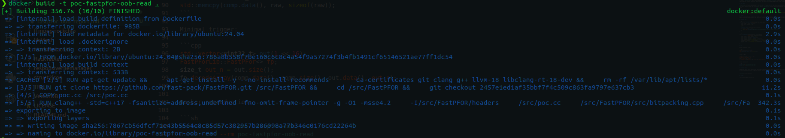
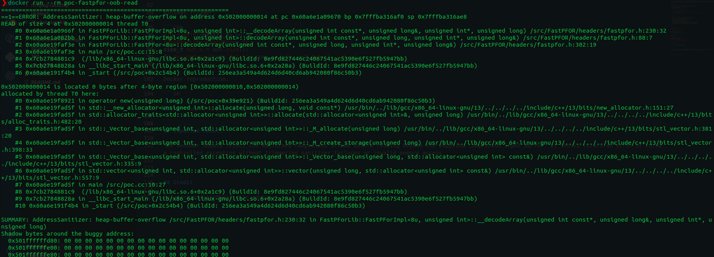

# CVE Request: FastPFOR `decodeArray()` out-of-bounds read

## Vulnerability Topic

Out-of-bounds read in FastPFOR decoding of malformed compressed integer streams.

## Vendor / GitHub repo

- Vendor: fast-pack / upstream FastPFOR maintainers
- GitHub repository: `fast-pack/FastPFOR`
- Github Issues: `https://github.com/fast-pack/FastPFOR/issues/139`

## Product Name

FastPFOR

## Release Version / Commit Hash / Affected Range

- Tested vulnerable commit: `2457e1ed1af35bbf7f4c509c863fa9797e637cb3`
- Short tested commit: `2457e1e`
- Affected file: `headers/fastpfor.h`
- Affected functions: `FastPForImpl::decodeArray()` and `FastPForImpl::__decodeArray()`
- Affected range: versions containing the same decoding logic where compressed metadata is read before checking the supplied compressed input length. Exact release range should be confirmed by maintainers.

## Vulnerability Type

Out-of-bounds read / malformed input decoder crash.

## CWE

CWE-125: Out-of-bounds Read

## Summary of Affection

A malformed FastPFOR compressed stream can cause the decoder to read beyond the supplied compressed input buffer. A one-word stream can make `decodeArray()` enter `__decodeArray()`, where compressed metadata such as `wheremeta`, `bytesize`, bitmap, and exception metadata are read before proving that the compressed input contains those words. Applications that decode untrusted FastPFOR streams may be crashed, causing denial of service.

## Root Cause

`decodeArray()` reads the decoded output count from the first input word and then calls `__decodeArray()` before validating that the compressed stream is long enough for the metadata read by `__decodeArray()`. `__decodeArray()` computes metadata pointers from attacker-controlled input and dereferences them before checking bounds. The final overrun check in `decodeArray()` happens after the unsafe reads and therefore cannot prevent the out-of-bounds access.

## Attack Preconditions

1. An application uses FastPFOR to decode compressed integer streams.
2. An attacker can supply, corrupt, or influence the compressed stream passed to `decodeArray()`.
3. The application does not independently authenticate or validate the compressed stream length and metadata before decoding.
4. No privileges are required unless imposed by the embedding application.

## Impact

Denial of service through process crash caused by out-of-bounds read / invalid read. Since the vulnerability is an out-of-bounds read, limited adjacent memory exposure may be possible in some application contexts, but the confirmed impact is crash/availability loss.

## Affected Code

```cpp
const uint32_t *decodeArray(const uint32_t *in, const size_t length,
                            IntType *out, size_t &nvalue) {
    const uint32_t *const initin(in);
    const size_t mynvalue = *in;
    ++in;
    ...
    __decodeArray(in, thisnvalue, out, thissize);
    ...
    if (initin + length < in) {
        throw std::logic_error("Decode run over output buffer. Potential buffer overflow!");
    }
}
```

```cpp
void __decodeArray(const uint32_t *in, size_t &length,
                   IntType *out, const size_t nvalue) {
    const uint32_t *const headerin = in++;
    const uint32_t wheremeta = headerin[0];
    const uint32_t *inexcept = headerin + wheremeta;
    const uint32_t bytesize = *inexcept++;
    const uint8_t *bytep = reinterpret_cast<const uint8_t *>(inexcept);
    inexcept += (bytesize + sizeof(uint32_t) - 1) / sizeof(uint32_t);
    IntType bitmap = *(reinterpret_cast<const IntType *>(inexcept));
    ...
}
```

## PoC

Minimal compressed stream:

```cpp
uint8_t raw[4] = {1, 0, 0, 0};
std::vector<uint32_t> comp(1);
std::memcpy(comp.data(), raw, sizeof(raw));
```

Minimal trigger:

```cpp
std::vector<uint32_t> out(1 << 16);
FastPForLib::FastPFor<> fp;
size_t out_n = out.size();
fp.decodeArray(comp.data(), comp.size(), out.data(), out_n);
```

Docker reproduction:

```sh
docker build -t poc-fastpfor-oob-read .
docker run --rm poc-fastpfor-oob-read
```

## Expected Result

The decoder should reject the malformed compressed stream before reading beyond the supplied compressed input buffer. It should return an error or throw a controlled exception without triggering sanitizer failures or invalid memory access.





## Credit

fa1c4 <azesinter@mail.ustc.edu.cn>