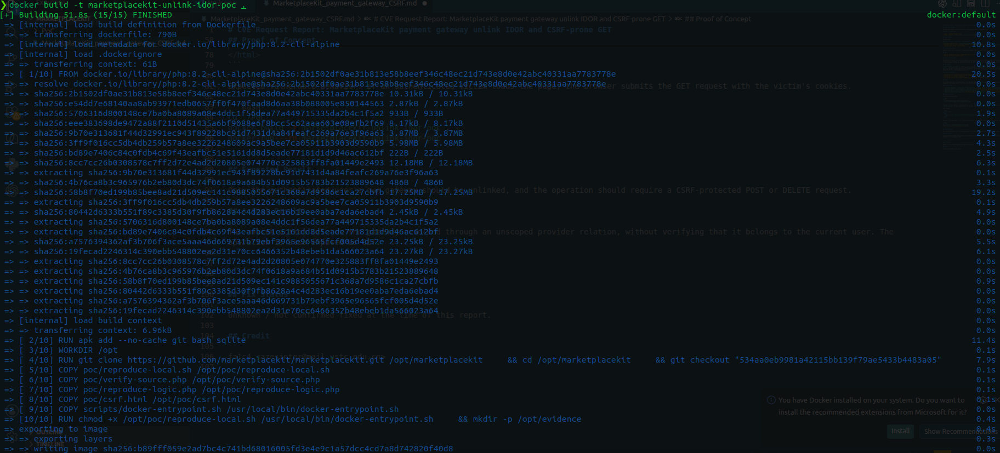
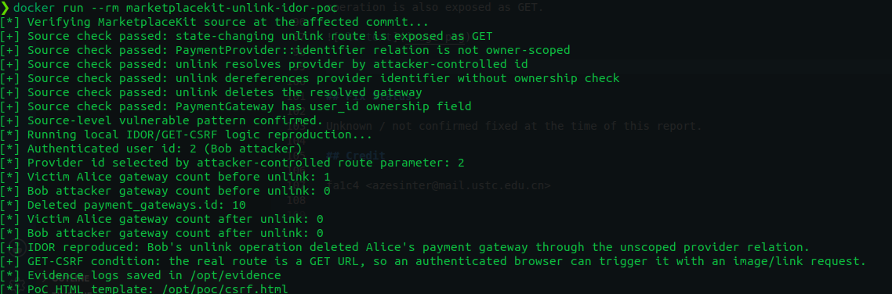

# CVE Request Report: MarketplaceKit payment gateway unlink IDOR and CSRF-prone GET

## Vulnerability Topic

MarketplaceKit payment gateway unlink IDOR and CSRF-prone state-changing GET route.

## Vendor / Github repo

- Vendor / project: MarketplaceKit
- GitHub repository: `https://github.com/marketplacekit/marketplacekit`

## Product Name

MarketplaceKit

## Release Version / Commit Hash / Affected Range

- Confirmed affected commit: `534aa0eb9981a42115bb139f79ae5433b4483a05`
- Affected range: not fully determined. Versions containing the vulnerable `BankAccountController@unlink` route and implementation are likely affected.
- Fixed version: unknown / not confirmed.

## Vulnerability Type

Insecure Direct Object Reference / authorization bypass, plus CSRF-prone state-changing GET.

## CWE

- CWE-639: Authorization Bypass Through User-Controlled Key
- CWE-352: Cross-Site Request Forgery

## Summary of Affection

MarketplaceKit exposes `GET /account/payments/{id}/unlink`, which deletes a payment gateway selected through a `PaymentProvider` relation. The unlink action does not constrain the resolved gateway to the authenticated user. An authenticated user can therefore unlink another user's payment gateway for a shared provider. Because the destructive action uses GET, it can also be triggered through a cross-site request from a victim's browser.

## Root Cause

`PaymentProvider::identifier()` returns a `hasOne` relation to `PaymentGateway` by matching `name` to `key`, but it does not filter by `payment_gateways.user_id`. The account index shows the intended safe pattern by eager-loading `identifier` with `where('user_id', auth()->user()->id)`. The unlink action omits this filter, resolves the provider's `identifier`, and deletes the resulting `PaymentGateway` without verifying ownership. The route is also defined as GET for a state-changing operation.

## Attack Preconditions

- The attacker has an authenticated verified MarketplaceKit account.
- Another user has a payment gateway row for a shared provider.
- The provider ID is known or guessable.
- For the CSRF variant, the victim is logged in and visits attacker-controlled content.

## Impact

An authenticated user can unlink another user's payment gateway, disrupting payouts or payment acceptance. The GET route additionally permits CSRF-style triggering from another website when the victim is authenticated.

## Affected Code

- `routes/web.php:69-84`: `Route::get('payments/{id}/unlink', 'BankAccountController@unlink')->name('payments.unlink');`
- `app/Models/PaymentProvider.php:29-30`: `identifier()` returns an unscoped relation to `PaymentGateway`.
- `app/Http/Controllers/Account/BankAccountController.php:124-126`: account index demonstrates a safer owner-scoped pattern.
- `app/Http/Controllers/Account/BankAccountController.php:133-137`: `unlink()` omits the owner filter and deletes the resolved `PaymentGateway`.
- `app/Models/PaymentGateway.php:11-12`: the deleted model contains `user_id`, indicating user ownership.

## Proof of Concept

Authenticated IDOR variant:

```bash
curl -i \
  -b 'marketplace_session=<bob-session-cookie>' \
  'https://market.example/account/payments/2/unlink'
```

Expected vulnerable behavior: the application resolves `PaymentProvider::find(2)->identifier` without checking `user_id = Bob`, deletes the related `payment_gateways` row, and redirects with an "Unlinked account" message.

CSRF variant:

```html
<!doctype html>
<html>
  <body>
    
  </body>
</html>
```

Expected vulnerable behavior: if an authenticated victim loads the page, the browser submits the GET request with the victim's cookies.

```bash
cd ./PoC
docker build -t marketplacekit-unlink-idor-poc .
docker run --rm marketplacekit-unlink-idor-poc
```

## Expected Result

Only the authenticated user's own gateway should be unlinked, and the operation should require a CSRF-protected POST or DELETE request.

## Actual Result

The unlink action deletes the gateway resolved through an unscoped provider relation, without verifying that it belongs to the current user. The operation is also exposed as GET.





## Fix Status

Unknown / not confirmed fixed at the time of this report.

## Credit

fa1c4 <azesinter@mail.ustc.edu.cn>

