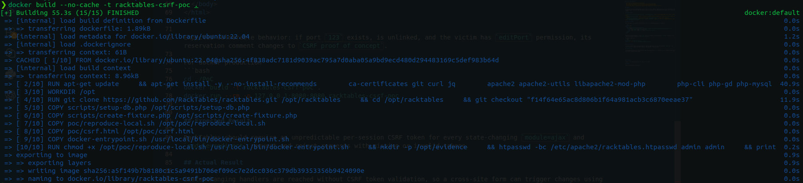
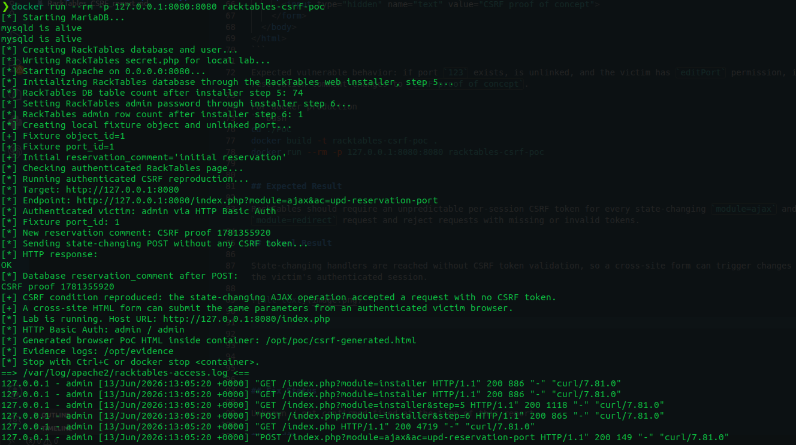

# CVE Request Report: RackTables missing CSRF protection in state-changing operations

## Vulnerability Topic

RackTables authenticated CSRF in state-changing form and AJAX operations.

## Vendor / Github repo

- Vendor / project: RackTables
- GitHub repository: `https://github.com/RackTables/racktables`

## Product Name

RackTables

## Release Version / Commit Hash / Affected Range

- Confirmed affected commit: `f14f64e65ac8d806b1f64a981acb3c6870eeae37`
- Affected range: not fully determined. Versions containing the vulnerable dispatcher and form generation behavior are likely affected.
- Fixed version: unknown / not confirmed.

## Vulnerability Type

Cross-Site Request Forgery.

## CWE

- CWE-352: Cross-Site Request Forgery

## Summary of Affection

RackTables state-changing form and AJAX operations rely on the victim's authenticated session and RackTables permission checks but do not include or verify an anti-CSRF token. A malicious website can cause an authenticated RackTables user to submit state-changing requests with their browser cookies. The reachable impact depends on the victim's permissions.

## Root Cause

The common operation form generator emits POST forms without a CSRF token. The redirect dispatcher and AJAX dispatcher call operation handlers after authentication and permission checks but without validating request origin or a CSRF token. Because authorization checks are performed for the logged-in victim, a cross-site request can still succeed if the victim has the required permission.

## Attack Preconditions

- The victim is authenticated to RackTables.
- The victim has permission for the targeted state-changing operation.
- The attacker can cause the victim to visit attacker-controlled HTML.
- The attacker knows or guesses the required object identifier, such as a port ID.

## Impact

An attacker can forge state-changing requests from a victim's browser. Depending on the victim's permissions and targeted handler, this can modify RackTables objects and metadata. The demonstrated PoC changes a port reservation comment.

## Affected Code

- `wwwroot/inc/interface-lib.php:1132-1143`: `printOpFormIntro()` emits state-changing POST forms without a CSRF token.
- `wwwroot/index.php:210-263`: redirect dispatcher invokes operation handlers after permission checks without CSRF validation.
- `wwwroot/index.php:174-183`: AJAX dispatcher calls `$ajaxhandler[$ac]()` without CSRF validation.
- `wwwroot/inc/ajax-interface.php:218-229`: `updatePortRsvAJAX()` reads `text` and `id`, checks permission, and calls `commitUpdatePortComment()`.

## Proof of Concept

Host this page on an attacker-controlled site and lure an authenticated victim to open it:

```html
<!doctype html>
<html>
  <body onload="document.forms[0].submit()">
    <form method="POST" action="https://racktables.example/index.php?module=ajax&ac=upd-reservation-port">
      <input type="hidden" name="id" value="123">
      <input type="hidden" name="text" value="CSRF proof of concept">
    </form>
  </body>
</html>
```

Expected vulnerable behavior: if port `123` exists, is unlinked, and the victim has `editPort` permission, its reservation comment changes to `CSRF proof of concept`.

For docker production
```bash
cd ./PoC
docker build -t racktables-csrf-poc .
docker run --rm -p 127.0.0.1:8080:8080 racktables-csrf-poc
```

## Expected Result

RackTables should require an unpredictable per-session CSRF token for every state-changing `module=ajax` and `module=redirect` request and reject requests with missing or invalid tokens.

## Actual Result

State-changing handlers are reached without CSRF token validation, so a cross-site form can trigger changes using the victim's authenticated session.






## Fix Status

Unknown / not confirmed fixed at the time of this report.

## Credit

fa1c4 <azesinter@mail.ustc.edu.cn>

