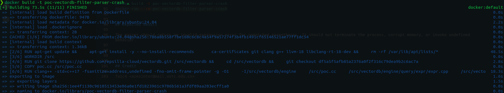
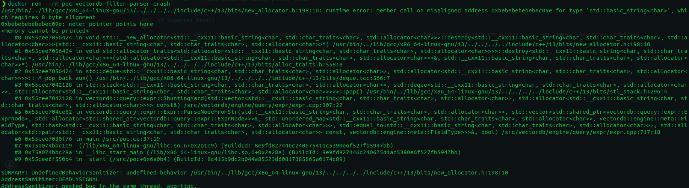

# CVE Request: VectorDB filter parser crash on unmatched closing parenthesis

## Vulnerability Topic

Parser crash / undefined behavior in VectorDB filter expression parsing caused by unmatched closing parentheses.

## Vendor / GitHub repo

- Vendor: epsilla-cloud / upstream VectorDB maintainers
- GitHub repository: `epsilla-cloud/vectordb`

## Product Name

VectorDB

## Release Version / Commit Hash / Affected Range

- Tested vulnerable commit: `df5a5f5afb85a2376a0f2f316c79dea9b2c6ac7a`
- Affected file: `engine/query/expr/expr.cpp`
- Affected functions: `SplitTokens()` and `ShuntingYard()`
- Affected range: versions containing the same logic where unmatched `)` tokens are accepted and `operator_stack.pop()` is called without confirming that a matching `(` exists. Exact release range should be confirmed by maintainers.
- Github Issues: `https://github.com/epsilla-cloud/vectordb/issues/159`

## Vulnerability Type

Unhandled exceptional condition / invalid parser state leading to process crash or undefined behavior.

## CWE

CWE-754: Improper Check for Unusual or Exceptional Conditions

## Summary of Affection

A malformed filter expression containing an unmatched closing parenthesis can cause VectorDB's filter parser to perform an invalid pop on an empty operator stack. If filter expressions are accepted from untrusted users, this can be used to crash a VectorDB service and cause denial of service.

## Root Cause

`SplitTokens()` tokenizes `)` without validating parenthesis balance. `ShuntingYard()` later handles a `)` by popping operators until it sees `(` and then unconditionally calls `operator_stack.pop()` to remove the `(`. If the closing parenthesis is unmatched, the stack is empty and the final pop is invalid.

## Attack Preconditions

1. VectorDB or an embedding service accepts filter expressions from a user or remote client.
2. The filter expression is parsed by `Expr::ParseNodeFromStr()`.
3. The attacker can submit a malformed filter expression such as `2)e+`.
4. No authentication is required unless the embedding application restricts query access.

## Impact

Denial of service. A crafted filter expression can crash the service or trigger undefined behavior in the parser. Network-exposed query APIs that parse untrusted filter expressions may be remotely crashable.

## Affected Code

```cpp
else if (c == '(' || c == ')') {
    token_list.push_back(std::string(1, c));
    i++;
}
```

```cpp
else if (str == ")") {
    while (!operator_stack.empty() && operator_stack.top() != "(") {
        res.push_back(operator_stack.top());
        operator_stack.pop();
    }
    operator_stack.pop(); // Pop the '('
}
```

## PoC

Malformed filter expression:

```text
2)e+
```

Minimal trigger:

```cpp
std::string expression = "2)e+";
std::vector<vectordb::query::expr::ExprNodePtr> nodes;
vectordb::query::expr::Expr expr;
auto status = expr.ParseNodeFromStr(expression, nodes, field_map, false);
```

Docker reproduction:

```sh
docker build -t poc-vectordb-filter-parser-crash .
docker run --rm poc-vectordb-filter-parser-crash
```

## Expected Result

The parser should return an invalid-expression error for unmatched parentheses. It should not terminate the process, corrupt memory, or invoke undefined behavior.





## Credit

fa1c4 <azesinter@mail.ustc.edu.cn>

