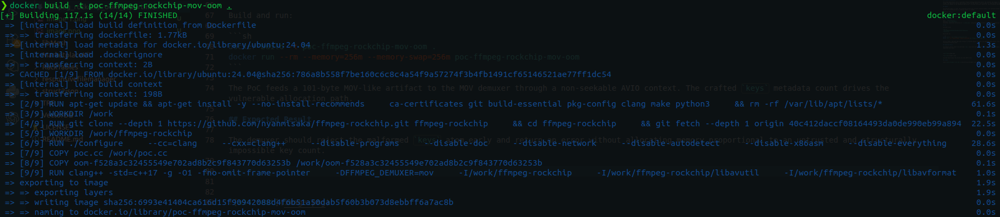
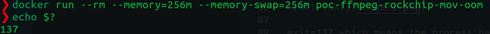

# Vulnerability Topic

ffmpeg-rockchip MOV metadata `keys` atom uncontrolled allocation leads to denial of service

## Vendor / GitHub Repo

`nyanmisaka/ffmpeg-rockchip`

## Product Name

`ffmpeg-rockchip`

## Release Version / Commit Hash / Affected Range

Confirmed affected commit: `40c412daccf08164493da0de990eb99a8948116b`

No specific release version was tested.

Affected range: confirmed at the tested commit; versions containing the same vulnerable `libavformat/mov.c::mov_read_keys()` implementation are likely affected until the maintainer applies a bounds check.

Github Issues: `https://github.com/nyanmisaka/ffmpeg-rockchip/issues/242`

## Vulnerability Type

Uncontrolled memory allocation / resource exhaustion / denial of service

## CWE

CWE-789: Memory Allocation with Excessive Size Value

## Summary of Affection

A crafted MOV/MP4 metadata atom can cause ffmpeg-rockchip to allocate memory based on an attacker-controlled `keys` atom count. The parser allocates the metadata-key table before validating that the atom contains enough bytes for the declared number of keys. A tiny input can therefore trigger a very large allocation and cause process termination or denial of service.

## Root Cause

In `libavformat/mov.c::mov_read_keys()`, the 32-bit `count` field from the `keys` atom is trusted for allocation. The function checks for integer overflow but does not check `count` against the remaining `atom.size` before allocation. Because each key entry requires at least an 8-byte key header, a count that exceeds `(atom.size - 8) / 8` is structurally impossible and should be rejected before allocation.

## Attack Preconditions

The target application uses a vulnerable ffmpeg-rockchip/libavformat build. The attacker can supply or cause processing of a crafted MOV/MP4 file or stream. The application parses MOV metadata using the MOV demuxer. No privileges are required beyond the ability to provide media input. User interaction depends on the embedding application: file-open workflows require UI, while automated upload/transcoding services may not.

## Impact

Availability impact is high. The vulnerable process may allocate excessive memory, hit container/system memory limits, abort, or be killed by the OOM killer. No confidentiality or integrity impact is claimed.

Suggested CVSS 3.1:

`CVSS:3.1/AV:N/AC:L/PR:N/UI:R/S:U/C:N/I:N/A:H` = 6.5 Medium

For automated server-side processing of untrusted uploads, `UI:N` may be appropriate.

## Affected Code

File: `libavformat/mov.c`
Function: `mov_read_keys()`
Vulnerable operation: allocation of `c->meta_keys` using attacker-controlled `count` before validating that `count` is bounded by the atom size.

## PoC

Attached files:

`poc.cc`
`oom-f528a3c32455549e702ad8b2c9f843770d63253b`
`Dockerfile`

Build and run:

```sh
docker build -t poc-ffmpeg-rockchip-mov-oom .
docker run --rm --memory=256m --memory-swap=256m poc-ffmpeg-rockchip-mov-oom
```

The PoC feeds a 101-byte MOV-like artifact to the MOV demuxer through a non-seekable AVIO context. The crafted `keys` metadata count drives the vulnerable allocation path.

## Expected Result

The demuxer should reject the malformed `keys` atom early and return an error without allocating memory proportional to an untrusted and structurally impossible key count.





exit=137 which means the process has been OOM killed.

## Credit

fa1c4 [azesinter@mail.ustc.edu.cn](mailto:azesinter@mail.ustc.edu.cn)
