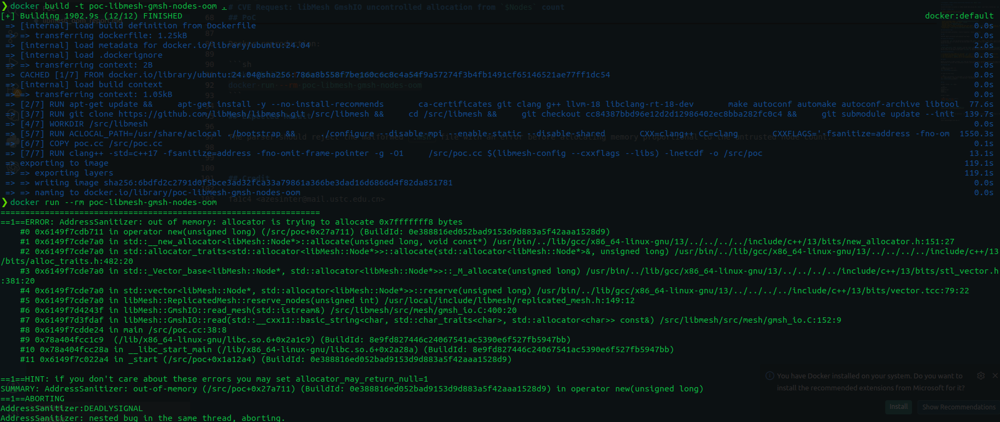

# CVE Request: libMesh GmshIO uncontrolled allocation from `$Nodes` count

## Vulnerability Topic

Uncontrolled memory allocation in libMesh GmshIO when parsing the `$Nodes` count from a crafted Gmsh `.msh` file.

## Vendor / GitHub repo

- Vendor: libMesh upstream maintainers
- GitHub repository: `libMesh/libmesh`

## Product Name

libMesh

## Release Version / Commit Hash / Affected Range

- Tested vulnerable commit: `cc84387bbd96e12d2d12986402ec8bba282fc0c4`
- Short tested commit from fuzz report: `ab36c00`
- Affected file: `src/mesh/gmsh_io.C`
- Affected function: `GmshIO::read_mesh()`
- Affected range: versions containing the same logic where `$Nodes` `num_nodes` is trusted and passed to `mesh.reserve_nodes(num_nodes)` before validating the file contents or bounding the value. Exact release range should be confirmed by maintainers.
- Github Issues: `https://github.com/libMesh/libmesh/issues/4482`

## Vulnerability Type

Uncontrolled memory allocation / resource exhaustion / denial of service.

## CWE

CWE-789: Memory Allocation with Excessive Size Value

## Summary of Affection

A crafted Gmsh `.msh` file can declare an extremely large `$Nodes` count. libMesh's Gmsh reader reserves memory based on this untrusted count before validating that the file contains the declared number of node records. This can cause excessive memory allocation, process abort, or out-of-memory denial of service.

## Root Cause

`GmshIO::read_mesh()` reads `num_nodes` from the `$Nodes` section and immediately calls `mesh.reserve_nodes(num_nodes)`. The value is fully controlled by the input file and is not checked against file size, remaining records, configured limits, or reasonable memory bounds before allocation. The same pattern exists in the Gmsh v4 path where `num_nodes` is read and reserved before node block contents are validated.

## Attack Preconditions

1. An application uses libMesh to read Gmsh `.msh` files via `GmshIO` or an equivalent mesh-loading path.
2. An attacker can supply or influence the `.msh` file.
3. The file contains a `$Nodes` section with an excessively large node count.
4. User interaction is required only if the embedding application requires a user to open/import the file.

## Impact

Denial of service. A small crafted `.msh` file can force a large memory reservation and cause the target process to abort or exhaust memory. Applications or services that automatically process untrusted mesh files may be remotely or batch-process crashable depending on deployment.

## Affected Code

```cpp
unsigned int num_nodes = 0;
in >> num_nodes;
mesh.reserve_nodes(num_nodes);
```

For Gmsh v4-style files:

```cpp
std::size_t num_entities = 0, num_nodes = 0, min_node_tag, max_node_tag;
in >> num_entities >> num_nodes >> min_node_tag >> max_node_tag;
mesh.reserve_nodes(num_nodes);
```

## PoC

Minimal crafted `.msh` input:

```text
$MeshFormat
2.2 0 8
$EndMeshFormat
$Nodes
4294967295
```

Minimal trigger:

```cpp
libMesh::Mesh mesh(init.comm());
libMesh::GmshIO io(mesh);
io.read("/tmp/poc.msh");
```

Docker reproduction:

```sh
docker build -t poc-libmesh-gmsh-nodes-oom .
docker run --rm poc-libmesh-gmsh-nodes-oom
```

## Expected Result

The parser should reject the malformed `.msh` file with an error before allocating memory proportional to the untrusted node count.



## Credit

fa1c4 <azesinter@mail.ustc.edu.cn>