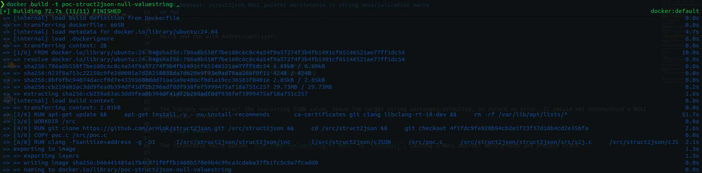
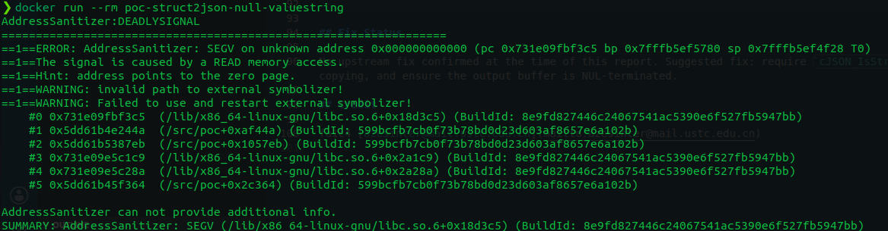

# CVE Request: struct2json NULL pointer dereference in string deserialization macro

## Vulnerability Topic

NULL pointer dereference in `S2J_STRUCT_GET_string_ELEMENT` when deserializing a non-string JSON value into a C string field.

## Vendor / GitHub repo

* Vendor: armink / upstream open-source maintainers
* GitHub repository: `armink/struct2json`

## Product Name

struct2json

## Release Version / Commit Hash / Affected Range

* Tested vulnerable commit: `4f1fdc9fe928b94cb2e1f23f37d18b4cd2e35bfa`
* Affected file: `struct2json/inc/s2jdef.h`
* Affected range: all versions/commits containing the same `S2J_STRUCT_GET_string_ELEMENT` implementation that copies `json_temp->valuestring` without type/pointer validation. Exact release range should be confirmed by maintainers.
* Github Issues: `https://github.com/armink/struct2json/issues/37`

## Vulnerability Type

NULL pointer dereference leading to denial of service.

## CWE

CWE-476: NULL Pointer Dereference

## Summary of Affection

A crafted JSON object can crash applications that use struct2json to deserialize attacker-controlled JSON into a struct containing a string field. If the JSON object contains a key matching the target string field, but the value is not a JSON string, struct2json passes a NULL `valuestring` pointer to `strncpy()`.

## Root Cause

The macro `S2J_STRUCT_GET_string_ELEMENT` checks only whether `cJSON_GetObjectItem()` returns a non-NULL `cJSON *`. It does not verify that the node is a string or that `json_temp->valuestring` is non-NULL before copying. For numeric and other non-string JSON values, cJSON leaves `valuestring` as NULL.

## Attack Preconditions

1. An application uses struct2json to parse JSON input into C structs.
2. The application uses `s2j_struct_get_basic_element(..., string, ...)` or an equivalent string deserialization macro.
3. An attacker can provide or influence the JSON input.
4. The JSON contains a field expected to be a string, but its value is a non-string type such as a number.

## Impact

Denial of service. The process can crash due to a NULL pointer dereference in `strncpy()`. The impact depends on the embedding application; network-exposed services that parse untrusted JSON may be remotely crashable.

## Affected Code

```c
#define S2J_STRUCT_GET_string_ELEMENT(to_struct, from_json, _element) \
    json_temp = cJSON_GetObjectItem(from_json, #_element); \
    if (json_temp) strncpy((to_struct)->_element, json_temp->valuestring, sizeof((to_struct)->_element)-1);
```

Related string array and `_EX` variants should also be reviewed because they use `valuestring` similarly.

## PoC

Minimal JSON input:

```json
{"nAMe":2}
```

Minimal C trigger:

```c
s2j_create_struct_obj(student, Student);
s2j_struct_get_basic_element(student, root, string, name);
```

Build and run with AddressSanitizer:

```sh
cd PoC
docker build -t poc-struct2json-null-valuestring .
docker run --rm poc-struct2json-null-valuestring
```

## Actual Result

The vulnerable macro passes `json_temp->valuestring == NULL` to `strncpy()`, causing a NULL pointer dereference and process crash.





## Credit

fa1c4 [azesinter@mail.ustc.edu.cn](mailto:azesinter@mail.ustc.edu.cn)
